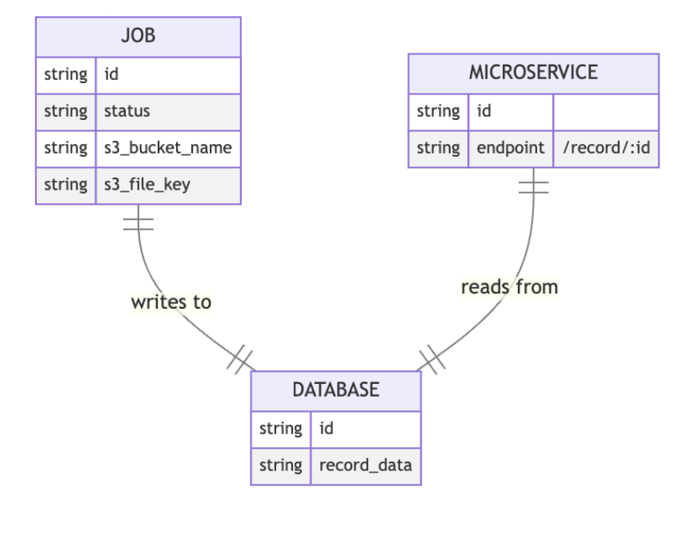

# S3JsonProcessor

The project fetches JSON Lines (jsonl) files from AWS S3, processes them, and writes them to the database. JSONL files are fetched and processed in parallel to increase processing speed.

## Contents

1. [Introduction](#introduction)
2. [Architecture Overview](#architecture)
3. [Testing](#testing)
4. [API Specification](#api-specification)
5. [Conclusion](#conclusion)

## Introduction 

In general terms, a job service (worker) and a microservice (api) were written in the project. Although it does not fully comply with the microservice principles (one service, one db), a proper architecture has been developed in line with the purpose of the project.

## Architecture Overview 

The architecture consists of two main components:

1. **Job (Worker):**
   - Fetches JSON Lines files from AWS S3, processes them, and writes the data to a database.
   - Performs operations in parallel for each JSON file entered as `objectKeys` in the `main.go` file.
   - Uses bulk insert method for inserting data into MongoDB collection, which is optimized for performance.
   - Records the files fetched from S3 and successfully written to the database in a log text called `history.txt`, avoiding repetition if the same file input is entered.

2. **Microservice (Api):**
   - Provides a RESTful endpoint to fetch a record by ID from the database.
   - Developed modularly and in accordance with microservice principles.
   - Extensible and highly performant, especially when retrieving records, thanks to the compound index feature added to the records collection in MongoDB.

## Testing 

Integration tests were written for both the Job (Worker) and Microservice (Api) sides. Tests cover S3 operations, bulk insert operations, and the GetRecord endpoint in the Microservice. The project can be tested using the `go test` command with the `_test.go` pages of the relevant classes, with the dependencies provided, without the need to run the project locally.

## API Specification 

The microservice provides a RESTful endpoint:

- **Endpoint:** `/api/v1/record/{id}`
- **Method:** GET
- **Description:** Retrieves a record by ID from the database.

Ciao ¯_(ツ)_/¯
